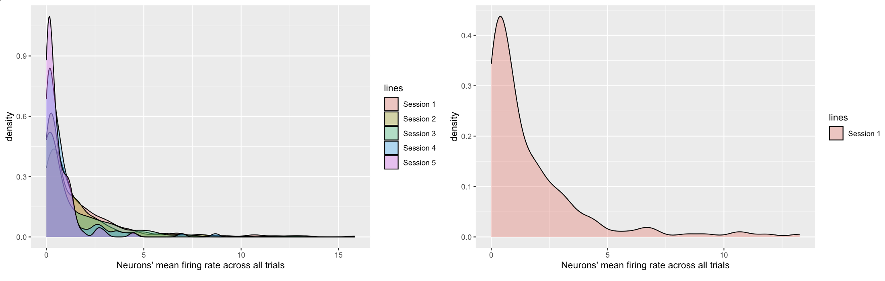

```{r setup, include=FALSE}
knitr::opts_chunk$set(echo = TRUE)
setwd("../Final_report/")
library(ggplot2)
library(dplyr)
library(ggpubr)
library(patchwork)
library(fields)
library(lme4)
library(grid)
library(ggResidpanel)
library(caret)
library(MASS)
library(pROC)
library(ROCR)
library(car)
```

```{r,echo=FALSE,results=FALSE}
session=list()
for(i in 1:5){
  session[[i]]=readRDS(paste('session',i,'.rds',sep=''))
}
```

# Abstract
This study analyzed a subset of data collected by Steinmetz et al. (2019). The goal of this study is to find out how the neural activity in the visual cortex is modulated by certain visual stimuli and how this information can be utilized to predict the outcome of the visual stimuli. Therefore, the spike trains of neurons in the visual cortex, which were recorded as the activity of the neurons in the mice’s visual cortex during the trials, were collected to analyze the relationship between visual stimuli and mice neural activity. 

# Introduction

To understand how the brain processes sensory information under different conditions, scholars study the modulation of visual responses by behavioral state in the mouse visual cortex. Frenkel et al. (2006) found that when a grating stimulus of a particular orientation is presented multiple times, it leads to a lasting increase in the responses produced by the test stimulus. Wang et al. (2007) found that the primary visual cortex that is situated laterally sends projections to a total of 15 cortical fields, out of which at least nine exhibit comprehensive and organized representations of the complete visual hemifield, thereby signifying distinct regions. Cristopher et al. (2010) designed an experiment in which they recorded neural activity in the visual cortex of mice while presenting visual stimuli under different behavioral conditions and find that that the visual responses of the mice were modulated by their behavioral state. 

# Background

Steinmetz et al. used Neuropixels probes to record from approximately 30,000 neurons in 42 brain regions of mice performing a visual discrimination task. They found that neurons encoding visual stimuli and upcoming choices occupied restricted regions in the neocortex, basal ganglia, and midbrain. In this study, we will focused on the spike trains of neurons in the visual cortex, which were recorded as the activities of the neurons. Five sessions (among 39 sessions) from two mice (among 10 mice) were studied. The first 3 session are from on mouse and the remainder from another mouse. In each session, the mouse was presented with visual stimuli on two screens positioned on both sides of it. Several hundred trials were conducted, and the visual stimuli were randomly varied in contrast levels that ranged from no stimulus to levels of 0.25, 0.5, and 1. The mouse used a wheel controlled by its forepaws to make decisions based on the visual stimuli, and a reward or penalty was given based on the accuracy of the mouse's decisions. The spike trains of neurons in the visual cortex were recorded as the activity of the neurons in the mice’s visual cortex. Our primary research questions are: 1. How do visual cortex neurons respond to stimuli presented on the left and right? 2. Can we predict trial outcomes by analyzing neural activities and stimuli? To answer the first question, we built a mixed effect model comprising two fixed-effect factors, left contrast and right contrast, and a random intercept for each session. For the second question, we developed regression models to identify the best-performing model. To evaluate the prediction performance, we used sensitivity and specificity measures based on the first 100 trials in Session 1. 


# Descriptive analysis

## Selection of outcome variable
In each trial of a specific session, the spike trains of certain number of visual neurons were recorded while the mouse was exposed to a combination of visual stimuli. As we can see in the following table

```{r,echo=FALSE,results=FALSE}
session=list()
for(i in 1:5){
  session[[i]]=readRDS(paste('./session',i,'.rds',sep=''))
}
```

|  session   | number of neurons  | number of trials |
|  :----:  | :----:  | :----:  |
| 1  | 178  | 214 |
| 2  | 533  | 251 |
| 3  | 228 | 228 |
| 4  | 120 | 249  |
| 5  | 99 | 254 |

The number of neurons in different sessions are different.

On the other hand, large part of the neurons didn't fire in the recorded 0.4 second in specific trial, but never fired neurons during each session are rare. 

For example, the following table shows the no firing rate in first 5 trial of session1. (number of neurons that didn't fire in certain trial/ number of neurons in corresponding session).

|  session 1  |
|  :----:  |  :----:  |
|  Trial ID   |  No firing rate  |
| 1  | 44.9%  | 
| 2  | 54.5% | 
| 3  | 48.3% | 
| 4  | 57.8% | 
| 5  | 41.6% | 

And the never fired rate (number of neurons never fired during some session/ number of neurons in that session) in each session is quite low:

| |
|  :----:  |  :----:  |
|  Session ID   |  Never firing rate  |
| 1  | 0.56%  | 
| 2  | 0.75% | 
| 3  | 3.95% | 
| 4  | 1.67% | 
| 5  | 0% | 

To analyze the relationship between visual stimuli and mice neural activity, we need to make the outcome variables of different session comparable. Since there is a considerable (about half) firing rate for each trial and the overall never firing rate is quite low for each session, it is meaningful to compute the mean firing rate of each trial. To be more detailed, the considerable firing rate for each trial means the firing rate is not contribute by small number of abnormal neurons and the low never firing rate ensure that in each session most of neurons have contributed to the mean firing rate of some trials.

The firing rate is defined as:

$$firing\enspace rate=\frac{total\enspace spikes\enspace of \enspace all \enspace neurons\enspace in\enspace certain\enspace trial}{number\enspace of\enspace neurons \times number\enspace of\enspace trials}$$

Here are some reasons why mean firing rate is a useful response variable:

- Reflects the average level of neural activity: Mean firing rate provides a measure of the average number of spikes (or action potentials) fired by a neuron over a given time period. This can be useful for characterizing the overall level of activity of a neuron, and how it changes in response to different stimuli or conditions.

- Can be used to compare across different neurons: By computing the mean firing rate across multiple trials or conditions, researchers can compare the activity of different neurons to each other. This can be useful for identifying neurons that respond preferentially to specific types of stimuli or for characterizing how different regions of the brain process information.

- Simple to compute and interpret: Mean firing rate is a relatively simple measure to compute, requiring only the counting of spikes over a given time period. It is also straightforward to interpret, providing a clear measure of the level of activity of a neuron in terms of spikes per second.


```{r,echo=FALSE,results=FALSE}
ID=1
t=0.4 # from Background 

n.trials=length(session[[ID]]$spks)
n.neurons=dim(session[[ID]]$spks[[1]])[1]

# Obtain the firing rate 
firingrate=numeric(n.trials)
for(i in 1:n.trials){
  firingrate[i]=sum(session[[ID]]$spks[[i]])/n.neurons/t
}

Aggregate1=data.frame(matrix(rep(ID,length(session[[ID]]$spks)),length(session[[ID]]$spks),1),session[[ID]]$contrast_left,session[[ID]]$contrast_right,firingrate)
```

```{r,echo=FALSE,results=FALSE}
ID=2
t=0.4 # from Background 

n.trials=length(session[[ID]]$spks)
n.neurons=dim(session[[ID]]$spks[[1]])[1]

# Obtain the firing rate 
firingrate=numeric(n.trials)
for(i in 1:n.trials){
  firingrate[i]=sum(session[[ID]]$spks[[i]])/n.neurons/t
}

Aggregate2=data.frame(matrix(rep(ID,length(session[[ID]]$spks)),length(session[[ID]]$spks),1),session[[ID]]$contrast_left,session[[ID]]$contrast_right,firingrate)
```

```{r,echo=FALSE,results=FALSE}
ID=3
t=0.4 # from Background 

n.trials=length(session[[ID]]$spks)
n.neurons=dim(session[[ID]]$spks[[1]])[1]

# Obtain the firing rate 
firingrate=numeric(n.trials)
for(i in 1:n.trials){
  firingrate[i]=sum(session[[ID]]$spks[[i]])/n.neurons/t
}

Aggregate3=data.frame(matrix(rep(ID,length(session[[ID]]$spks)),length(session[[ID]]$spks),1),session[[ID]]$contrast_left,session[[ID]]$contrast_right,firingrate)
```

```{r,echo=FALSE,results=FALSE}
ID=4
t=0.4 # from Background 

n.trials=length(session[[ID]]$spks)
n.neurons=dim(session[[ID]]$spks[[1]])[1]

# Obtain the firing rate 
firingrate=numeric(n.trials)
for(i in 1:n.trials){
  firingrate[i]=sum(session[[ID]]$spks[[i]])/n.neurons/t
}

Aggregate4=data.frame(matrix(rep(ID,length(session[[ID]]$spks)),length(session[[ID]]$spks),1),session[[ID]]$contrast_left,session[[ID]]$contrast_right,firingrate)
```

```{r,echo=FALSE,results=FALSE}
ID=5
t=0.4 # from Background 

n.trials=length(session[[ID]]$spks)
n.neurons=dim(session[[ID]]$spks[[1]])[1]

# Obtain the firing rate 
firingrate=numeric(n.trials)
for(i in 1:n.trials){
  firingrate[i]=sum(session[[ID]]$spks[[i]])/n.neurons/t
}

Aggregate5=data.frame(matrix(rep(ID,length(session[[ID]]$spks)),length(session[[ID]]$spks),1),session[[ID]]$contrast_left,session[[ID]]$contrast_right,firingrate)
```

Therefore, we construct five dataframes which contain the session ID, contrast of the left stimulus, contrast of the right stimulus,firing rate of all five sessions then aggregate them into a new dataframe named "Aggregate".

```{r,echo=FALSE,results=FALSE}
Aggregate <- rbind(Aggregate1,Aggregate2,Aggregate3,Aggregate4,Aggregate5)
names(Aggregate) <- c("session ID","contrast left","contrast right","firing rate")
head(Aggregate)
tail(Aggregate)
```

## Selection of factors

The following figure summarizes firing rate by contrast of the left stimulus and contrast of the right stimulus.

```{r,echo=FALSE,results=FALSE}
# par(mfrow=c(1,2))
# boxplot(Aggregate$`firing rate`~ Aggregate$`contrast left`, frame = FALSE,xlab = "contrast of the left stimulus",ylab="firingrate",main="Aggregate")
# boxplot(Aggregate$`firing rate` ~ Aggregate$`contrast right`, data=Aggregate, frame = FALSE,xlab = "contrast of the right stimulus",ylab="firingrate",main="Aggregate")
# par(mfrow=c(1,1))

left_contrast_plot <- ggplot(data=Aggregate,aes(x=`contrast left`,y=`firing rate`,color=as.factor(`session ID`)))+geom_jitter(alpha=0.3)+ scale_x_continuous(breaks = c(0, 0.25, 0.5,1), labels = c("0", "0.25", "0.5",'1'))+labs(color = "session ID")


right_contrast_plot <- ggplot(data=Aggregate,aes(x=`contrast right`,y=`firing rate`,color=as.factor(`session ID`)))+geom_jitter(alpha=0.3)+ scale_x_continuous(breaks = c(0, 0.25, 0.5,1), labels = c("0", "0.25", "0.5",'1'))+labs(color = "session ID")

left_contrast_plot+right_contrast_plot
```

<div style="text-align: center;">
Figure 1: scatter plots of mean firing rate in different sessions under different left/right contrast level
</div>


`Figure 1` show that the mean firing rate distributions in different sessions differ from each other, and in each session the distribution of neurons' mean firing rate is relatively concentrated at certain contrast left/right level. For example, session 1 tends to be concentrated around the highest level and session 5 seems to concentrated around the lowest level. We guess this may because neurons in each session are collected by sensors and the location of sensors have some random property (This guess is according to the discussion in the piazza forum). So we decide to consider the session ID as a `random effect`.

<div style="text-align:center">
  <figure>
    
    <figcaption>Figure 2: Color maps for session 1-4</figcaption>
  </figure>
</div>


```{r,echo=FALSE,results=FALSE}
agg_df_1 <- aggregate(firingrate ~ session..ID...contrast_left + session..ID...contrast_right, data = Aggregate5, mean)
```


```{r,echo=FALSE,results=FALSE}
# Create a matrix from the 'firingrate' column of the 'agg_df_1' data frame
mat <- matrix(data = agg_df_1$firingrate, nrow = 4, ncol = 4,dimnames = list(c("0", "0.25", "0.5", "1"), 
                              c("0", "0.25", "0.5", "1")))

# Create the image of the matrix using the gradient color scale
image(mat, col = heat.colors(10), 
      xaxt = "n", yaxt = "n",
      xlab = "Left Contrast", ylab = "Right Contrast", 
      main = "Session 5 mean firing rate")
image.plot(legend.only = TRUE, col = heat.colors(10), zlim = c(min(mat), max(mat)), nlevel = 10, legend.shrink = 0.8, legend.mar = 5, legend.width = 1, main = "Low Values", side = 4)
# Add row and column labels
axis(1, at = c(0,0.33,0.66,0.99), labels = colnames(mat))
axis(2, at = c(0,0.33,0.66,0.99), labels = rownames(mat), las = 2)
```

<div style="text-align: center;">
Figure 3: Color maps for session 5
</div>

The above color maps in `Figure 2` and `Figure 3` depict the mean firing rate in each sessions given the combination of contrasts presented. They show that the firing rate tend to be higher as the left/ritght contrast level ascending. However, they are not symmetry about the $Left\enspace Contrast=Right\enspace Contrast$ line, which means that the same level of left and right contrast tend to have different impact on the mean firing rate to mice, so we will treat the left contrast level and the right contrast level as two independent predictors. 

Furthermore, as we can see in the color maps, the mean firing rate does not ascend or descend with the level of left/right contrast increasing in all sessions, we conclude that there is no linear relationship between the session level and left/right contrast level. So we will treat left/right contrast level as `categorical variables` when we built models.

## Mean firing rate reduced by time
Furthermore, we are interested in the distribution of neurons mean firing rate over 0.4 second in each trial for specific session, so we calculated the mean firing rate of each neuron in across all trials for 5 sessions. Then we draw the density plot for each session to see the distribution of neurons' mean firing rate in across all trials. Neuron's mean firing rate across all trials is calculated as (certain neuron's total spikes in 0.4s for all trials of corresponding session/ number of trials in that session).

<div style="text-align:center">
  <figure>
    
    <figcaption>Figure 4: Aggregated neuron dentisy and session 1 neuron density</figcaption>
  </figure>
</div>

```{r,echo=FALSE,results=FALSE}
# Define an empty list to hold the data frames
neuron_list <- list()
for(Session_ID in seq(1,5))
{
#number of trials in each session
n.trials=length(session[[Session_ID]]$spks) 
#number of neurons in each session
n.neurons=dim(session[[Session_ID]]$spks[[1]])[1] 
# number of time
number_of_time=dim(session[[Session_ID]]$spks[[1]])[2] 


# initiate the time reduced matrix---the number of spikes of each neuron in each trial was summed by time, in the matrix row correspond to different trial, column refers to different neuron
sum_spks_neuron <- matrix(0,nrow =n.trials,ncol=n.neurons)

for(i in seq(1,n.trials))
  sum_spks_neuron[i,]=rowSums(session[[Session_ID]]$spks[[i]])

data <- data.frame(value=colSums(sum_spks_neuron)/n.trials)
  neuron_list[[Session_ID]] <- data

file_name <- paste("time_reduced_session", Session_ID, ".csv", sep = "")

write.csv(as.data.frame(cbind(session[[Session_ID]]$contrast_left,session[[Session_ID]]$contrast_right,sum_spks_neuron)),file = file_name)
}

neuron_data <- data.frame(dens=c(neuron_list[[1]]$value,neuron_list[[2]]$value,neuron_list[[3]]$value,neuron_list[[4]]$value,neuron_list[[5]]$value),lines=rep(c("Session 1","Session 2","Session 3","Session 4","Session 5"),c(178,533,228,120,99)))
neuron_density_plot <- ggplot(neuron_data, aes(x = dens, fill = lines)) + geom_density(alpha = 0.4)+
  xlab("Neurons' mean firing rate across all trials")

neuron_data_1 <- data.frame(dens=c(neuron_list[[1]]$value),lines=rep(c("Session 1"),c(178)))
neuron_density_plot_1<- ggplot(neuron_data_1, aes(x = dens, fill = lines)) + geom_density(alpha = 0.4)+
  xlab("Neurons' mean firing rate across all trials")

neuron_data_2 <- data.frame(dens=c(neuron_list[[2]]$value),lines=rep(c("Session 2"),c(533)))
neuron_density_plot_2<- ggplot(neuron_data_2, aes(x = dens, fill = lines)) + geom_density(alpha = 0.4)+
  xlab("Neurons' mean firing rate across all trials")

neuron_data_3 <- data.frame(dens=c(neuron_list[[3]]$value),lines=rep(c("Session 3"),c(228)))
neuron_density_plot_3<- ggplot(neuron_data_3, aes(x = dens, fill = lines)) + geom_density(alpha = 0.4)+
  xlab("Neurons' mean firing rate across all trials")

neuron_data_4 <- data.frame(dens=c(neuron_list[[4]]$value),lines=rep(c("Session 4"),c(120)))
neuron_density_plot_4<- ggplot(neuron_data_4, aes(x = dens, fill = lines)) + geom_density(alpha = 0.4)+
  xlab("Neurons' mean firing rate across all trials")

neuron_data_5 <- data.frame(dens=c(neuron_list[[5]]$value),lines=rep(c("Session 5"),c(99)))
neuron_density_plot_5<- ggplot(neuron_data_5, aes(x = dens, fill = lines)) + geom_density(alpha = 0.4)+
  xlab("Neurons' mean firing rate across all trials")

neuron_density_plot_2+neuron_density_plot_3+neuron_density_plot_4+neuron_density_plot_5
```

<div style="text-align: center;">
Figure 5: Neuron density for session 2-5
</div>

From the above density plots in `Figure 4` and `Figure 5`, we guess that there are three types of neurons in rats visual cortex that have different response level ranges when rats are exposed to visual stimulus. So we decide to divide all the neurons from all sessions into 3 clusters. Since we guess three types of neurons have different mean firing rate (low, middle, high), the mean firing rate under $4\times4=16$ kinds of visual stimulus combination were calculated for each neuron as there coordinate --- each neuron has a 16 dimensional vector whose entries are the mean firing rate under specific visual stimulus. 

To divide them into 3 clusters, we choose `K-means` clustering algorithm with euclidean distance and derive the labels vector for them. According to the cluster labels, we draw the histograms of neurons' mean firing rate for 5 sessions.

```{r,echo=FALSE,results=FALSE}
neuron_types=read.csv("./Processed/neuron_types.csv")
neuron_types=c(neuron_types)

# create a null vector using the vector() function
n.neurons_in_diff_session <- numeric(length = 5)

for(Session_ID in seq(1,5))
{
n.trials=length(session[[Session_ID]]$spks)
n.neurons=dim(session[[Session_ID]]$spks[[1]])[1]
n.neurons_in_diff_session[Session_ID]=dim(session[[Session_ID]]$spks[[1]])[1]
}

# create the factor variable indicating which part each element belongs to
f <- rep(1:5, c(n.neurons_in_diff_session[1], n.neurons_in_diff_session[2], n.neurons_in_diff_session[3],n.neurons_in_diff_session[4],n.neurons_in_diff_session[5]))

# split the vector into three parts based on the factor variable
neuron_labels <- split(neuron_types$X0, f)
```


<div style="text-align:center">
  <figure>
    
    <figcaption>Figure 6: Clustered neurons mean firing rate in session 1-4</figcaption>
  </figure>
</div>

```{r,echo=FALSE,results=FALSE,message=FALSE,warning= FALSE}
labeled_neuron_list <- list()
for(Session_ID in seq(1,5))
{
n.trials=length(session[[Session_ID]]$spks)
n.neurons=dim(session[[Session_ID]]$spks[[1]])[1]
number_of_time=dim(session[[Session_ID]]$spks[[1]])[2]

sum_spks_neuron <- matrix(0,nrow =n.trials,ncol=n.neurons)

for(i in seq(1,n.trials))
  sum_spks_neuron[i,]=rowSums(session[[Session_ID]]$spks[[i]])

n.cluster1=sum(c(neuron_labels[[Session_ID]]==0))
#print(n.cluster1) 
n.cluster2=sum(c(neuron_labels[[Session_ID]]==1))
#print(n.cluster2) 
n.cluster3=sum(c(neuron_labels[[Session_ID]]==2))
#print(n.cluster3)


neuron_data <- data.frame(dens=c(colSums(sum_spks_neuron[,c(c(neuron_labels[Session_ID][[1]])==0)])/n.trials,colSums(sum_spks_neuron[,c(c(neuron_labels[Session_ID][[1]])==1)])/n.trials,colSums(sum_spks_neuron[,c(c(neuron_labels[Session_ID][[1]])==2)])/n.trials),lines=rep(c("Cluster 1","Cluster 2","Cluster 3"),c(n.cluster1,n.cluster2,n.cluster3)))

temp=rbind(neuron_labels[[Session_ID]],sum_spks_neuron)
labeled_neuron_list[[Session_ID]]=cbind(c(NA,session[[Session_ID]]$mouse_name),c(NA,session[[Session_ID]]$feedback_type),c(NA,session[[Session_ID]]$contrast_left),c(NA,session[[Session_ID]]$contrast_right),temp)


neuron_density_plot <- ggplot(neuron_data, aes(x = dens,fill=lines)) + 
    geom_histogram(data=neuron_data, alpha = 0.5,position = "identity",binwidth = 0.39)+
    scale_fill_manual(name="group",values=c("red","blue","green"))+
  xlab("Neurons' mean firing rate")+ggtitle(paste('Session',Session_ID,sep=''))+theme(plot.title = element_text(hjust = 0.5))
ggsave(paste('clustered_session ',Session_ID,'.png',sep = ''))
}
print(neuron_density_plot)
```

<div style="text-align: center;">
Figure 7: Clustered neurons mean firing rate in session 5
</div>

As we can see from the above histograms in `Figure 6` and `Figure 7`, in all the session the range of mean firing rate of three clusters have tiny overlap, which means that the cluster labels we get can adequately divide the neurons in all the sessions into three clusters with different mean firing rate range. 

Furthermore, the sequence of mean firing rate's range for 3 clusters are consistent in all 5 sessions, which also means our clustering method that based on the mean firing rate for $4\times 4$ stimulus combinations works well. We also note that the relative amount of neurons in 3 clusters are also consistent among 5 session. For each session, `Cluster 1` has the highest mean firing rate range and lowest amount, meanwhile `Cluster 2` has the lowest mean firing rate range and highest amount, and `Cluster 3` has both the medium mean firing rate range and medium amount. However, there is no `Cluster 1` in session 5, which may means our clustering has some flaw.

```{r,echo=FALSE,results=FALSE,message=FALSE}
for( Session_ID in seq(1,5))
{n.trials=length(session[[Session_ID]]$spks)
n.neurons=dim(session[[Session_ID]]$spks[[1]])[1]
number_of_time=dim(session[[Session_ID]]$spks[[1]])[2]

sum_spks_1 <- matrix(0,nrow = n.neurons,ncol = number_of_time)

for(i in seq(1,n.trials))
  sum_spks_1=sum_spks_1+session[[Session_ID]]$spks[[i]]

sum_spks_1=data.frame(time = rep(1:39, dim(session[[1]]$spks[[1]])[1]),
                 #neuron_id = rep(1:dim(session[[1]]$spks[[1]])[1], each = 39),
                 spike_value = colSums(sum_spks_1))
ggplot(data = sum_spks_1) + geom_smooth(mapping = aes(x = time, y=spike_value))+ggtitle(paste("Time_trend_session",Session_ID))
ggsave(paste("Time_trend_session",Session_ID,".png"))
}
```


# Inferential analysis (Q1)

In the inferential analysis, we build a mixed effect model where the two fixed-effect factors are left contrast and right contrast, and a random intercept is included for each session. As a result, Q1 reduces to test the null hypothesis that the two factors have no interaction effect. According to our analysis in Descriptive analysis part, we choose session as random effect and the left contrast and right contrast are treated as categorical variables.

## Full model

$$
f_{ijkl}=\mu_{...}+\alpha_i+\beta_j+\gamma_k+(\beta\gamma)_{jk}+\varepsilon_{ijkl}
$$

where $\alpha_i,i=1,\cdots,5$ is the random effect of different sessions with 5 random intercept, $\beta_j,j=1,2,3,4$ is the factor effect of contrast of the left stimulus 0(j=1), 0.25(j=2), 0.5(j=3), 1(j=4), $\gamma_k,k=1,2,3,4$ is the factor effect of contrast of the right stimulus0(k=1), 0.25(k=2), 0.5(k=3), 1(k=4), $(\beta\gamma)_{jk}$ is the interaction effect. $l,l=1,\cdots,n_{ijk}$ denotes the observation in session $i$ with left contrast type $j$ and right contrast type $k$. $\mu_{...}$ is the overall mean firing rate.So $f_{ijkl}$ denotes the mean firing rate in session $i$ with left contrast type $j$ and right contrast type $k$.

Constraints: $\sum_{j=1}^{4}\beta_j=0$, $\sum_{k=1}^{4}\gamma_j=0$, $\sum_{j=1}^{4}(\beta\gamma)_{jk}=\sum_{k=1}^{4}(\beta\gamma)_{jk}=0$

$\alpha_i\sim_{i.i.d.} N(0,\sigma^2_\alpha),\varepsilon_{ijkl}\sim_{i.i.d.}N(0,\sigma^2)$


## Reduced model

$$
f_{ijkl}=\mu_{...}+\alpha_i+\beta_j+\gamma_k++\varepsilon_{ijkl}
$$

The notation of reduced model is the same as in full model, except that there is no interaction term in the reduced model.

After build the full model and reduced model, we test the null hypothesis that the two factors have no interaction effect on both clustered and non-clustered data using `lmer` and `anova`. As we can see from the below tables, at the significance level 0.05, all the test based on clustered data yield not to reject the null hypothesis that the interaction term is not significant since all P-values are greater than 0.05. However, when we move to the test based on non-clustered data, the test shows that we should reject the null hypothesis that the interaction term is not significant since its P-value is lower than 0.05. 

To decide whether to reject the null hypothesis or not, we found that the AIC for cluster2 based models is lower than the AICs of non-clustered based mode and its p value is 0.45. So we decide to select `cluster2 based model` and choose not to reject the null hypothesis that the interaction term is not significant at 0.05 significance level. As we can see in the following table, the AICs for cluster1 based model and cluster3 based model are relatively larger, this may because the neurons amount in cluster1 and cluster3 are too small.

### Analysis based on clustered data

```{r,echo=FALSE,results=FALSE,message=FALSE}
cluster_index_1 <- list()
cluster_index_2 <- list()
cluster_index_3 <- list()
for(Session_ID in seq(1,5))
{
cluster_1 <- labeled_neuron_list[[Session_ID]][2:dim(labeled_neuron_list[[Session_ID]])[1],which(labeled_neuron_list[[Session_ID]][1,] == 0)]
class(cluster_1) <- "numeric"
cluster_1 <- rowSums(cluster_1)/sum(labeled_neuron_list[[Session_ID]][1,5:length(labeled_neuron_list[[Session_ID]][1,])] == 0)
cluster_index_1[[Session_ID]] <- cluster_1


cluster_2 <- labeled_neuron_list[[Session_ID]][2:dim(labeled_neuron_list[[Session_ID]])[1],which(labeled_neuron_list[[Session_ID]][1,] == 1)]
class(cluster_2) <- "numeric"
cluster_2 <- rowSums(cluster_2)/sum(labeled_neuron_list[[Session_ID]][1,5:length(labeled_neuron_list[[Session_ID]][1,])] == 1)
cluster_index_2[[Session_ID]] <- cluster_2

cluster_3 <- labeled_neuron_list[[Session_ID]][2:dim(labeled_neuron_list[[Session_ID]])[1],which(labeled_neuron_list[[Session_ID]][1,] == 2)]
class(cluster_3) <- "numeric"
cluster_3 <- rowSums(cluster_3)/sum(labeled_neuron_list[[Session_ID]][1,5:length(labeled_neuron_list[[Session_ID]][1,])] == 2)
cluster_index_3[[Session_ID]] <- cluster_3
}
```

```{r,echo=FALSE,results=FALSE,message=FALSE}
Session_series <- rep(1:5, c(214, 251, 228,249,254))
left_series <- c(session[[1]]$contrast_left,session[[2]]$contrast_left,session[[3]]$contrast_left,session[[4]]$contrast_left,session[[5]]$contrast_left)
right_series <- c(session[[1]]$contrast_right,session[[2]]$contrast_right,session[[3]]$contrast_right,session[[4]]$contrast_right,session[[5]]$contrast_right)
feed_back_type_series <- c(session[[1]]$feedback_type,session[[2]]$feedback_type,session[[3]]$feedback_type,session[[4]]$feedback_type,session[[5]]$feedback_type)
```

```{r,echo=FALSE,results=FALSE,message=FALSE}
cluster_1_mfr <- c(cluster_index_1[[1]],cluster_index_1[[2]],cluster_index_1[[3]],cluster_index_1[[4]],cluster_index_1[[5]])
cluster_one <- data.frame(cluster_1_mfr,as.factor(right_series),as.factor(left_series),as.factor(Session_series))
additive_1 <- lmer(cluster_1_mfr~as.factor(right_series)+as.factor(left_series)+(1|Session_series),data=cluster_one)
no_additive_1 <- lmer(cluster_1_mfr~as.factor(right_series)*as.factor(left_series)+(1|Session_series),data=cluster_one)
anova(additive_1,no_additive_1)
```

```{r,echo=FALSE,results=FALSE,message=FALSE}
cluster_2_mfr <- c(cluster_index_2[[1]],cluster_index_2[[2]],cluster_index_2[[3]],cluster_index_2[[4]],cluster_index_2[[5]])
cluster_two <- data.frame(cluster_2_mfr,as.factor(right_series),as.factor(left_series),as.factor(Session_series))
additive_2 <- lmer(cluster_2_mfr~as.factor(right_series)+as.factor(left_series)+(1|Session_series),data=cluster_two)
no_additive_2 <- lmer(cluster_2_mfr~as.factor(right_series)*as.factor(left_series)+(1|Session_series),data=cluster_two)
anova(additive_2,no_additive_2)
```

```{r,echo=FALSE,results=FALSE,message=FALSE}
cluster_3_mfr <- c(cluster_index_3[[1]],cluster_index_3[[2]],cluster_index_3[[3]],cluster_index_3[[4]],cluster_index_3[[5]])
cluster_three <- data.frame(cluster_3_mfr,as.factor(right_series),as.factor(left_series),as.factor(Session_series))
additive_3 <- lmer(cluster_3_mfr~as.factor(right_series)+as.factor(left_series)+(1|Session_series),data=cluster_three)
no_additive_3 <- lmer(cluster_3_mfr~as.factor(right_series)*as.factor(left_series)+(1|Session_series),data=cluster_three)
anova(additive_3,no_additive_3)
```

| Cluster ID    | P-value | AIC of Full model | AIC of Reduced model |
|:--------:|:---:|:------:|:------:|
| 1  | 0.14 | 5121.1|5116.6 |
| 2 | 0.45 | -1006.6|-1015.7 |
| 3  | 0.27 | 2660.8|2654.0 |


### Analysis based on non-clustered data

```{r,echo=FALSE,results=FALSE,message=FALSE}
Aggregate$`session ID`=as.factor(Aggregate$`session ID`)
Aggregate$`contrast left`=as.factor(Aggregate$`contrast left`)
Aggregate$`contrast right`=as.factor(Aggregate$`contrast right`)
additive_all <- lmer(Aggregate$`firing rate`~as.factor(Aggregate$`contrast left`)+as.factor(Aggregate$`contrast right`)+(1|Aggregate$`session ID`))
no_additive_all <- lmer(Aggregate$`firing rate`~as.factor(Aggregate$`contrast left`)*as.factor(Aggregate$`contrast right`)+(1|Aggregate$`session ID`))
anova(additive_all,no_additive_all)
```

| Non-clustered    | P-value | AIC of Full model | AIC of Reduced model |
|:--------:|:---:|:------:|:------:|
|   | 0.041 | 2349.8|2349.3 |


# Sensitivity analysis (Q1)
To check if the assumptions of the model are adequate, we conduct model diagnostics.

```{r,echo=FALSE,results=FALSE,message=FALSE}
aov_residuals <- residuals(object = additive_1)
shapiro.test(x = aov_residuals )

aov_residuals <- residuals(object = additive_2)
shapiro.test(x = aov_residuals )

aov_residuals <- residuals(object = additive_3)
shapiro.test(x = aov_residuals )

aov_residuals <- residuals(object = additive_all)
shapiro.test(x = aov_residuals )
```

```{r,echo=FALSE,results=FALSE,message=FALSE}
resid_compare(models = list(additive_1, 
                            additive_2, 
                            additive_3,
                            additive_all),
              plots = c("resid", "qq","hist"),
              #smoother = TRUE,
              qqbands = TRUE,
              title.opt = TRUE)
```

<div style="text-align: center;">
Figure 8: Diagnostic Plots for cluster based models and non-cluster based model
</div>

The first 3 columns of `Figure 8` are from models that based on cluster 1 neurons, cluster 2 neurons and cluster 3 neurons respectively. The last columns is the model based on non-clustered dataset. 

The residual plots show no obvious non-linearity. It can be seen that all the residuals histograms seem to have normal distribution. The Q-Q plots based on clustered dataset are little right skewed and the QQ plot based on non-clustered dataset are also little right skewed. To test the normality assumptions we conduct  Shapiro-Wilk normality test for above four additive models and find that all their p values are less than `0.001`, which means we can reject the null hypothesis that the error terms are not normally distributed in above full additive models. However, although the normality assumption is not adequate, since our sample size is relatively large, the affect of non-normality can be dismissed a lot by the central limit theorem.

To test the homogeneity of variance, we conducted Levene's tests and the one of the cluster 2 an cluster 3 based model has p value is larger than 0.05 and the cluster1 based model has p value less than 0.05, this may because the neuron's number in cluster1 are too small. The model based on non-clustered model has p value 0.34 (>0.05), so the homogeneity of variance is adequate for all models except cluster1 based model.

```{r,echo=FALSE,results=FALSE,message=FALSE}
leveneTest(cluster_1_mfr~cluster_one$as.factor.right_series.*cluster_one$as.factor.left_series.,data=cluster_one)
leveneTest(cluster_2_mfr~cluster_two$as.factor.right_series.*cluster_two$as.factor.left_series.,data=cluster_two)
leveneTest(cluster_3_mfr~cluster_three$as.factor.right_series.*cluster_three$as.factor.left_series.,data=cluster_three)
leveneTest(Aggregate$`firing rate`~Aggregate$`contrast left`*Aggregate$`contrast right`,data=Aggregate)
```


Furthermore, we are also interested in whether the effects from sessions are random or not. We choose to conduct the F test and the hypotheses are:

$$
H_0:\sigma^2_\alpha=0\quad V.S.\enspace H_a:\sigma^2_\alpha\ne 0
$$

$$
Full\enspace model: f_{ijkl}=\mu_{...}+\alpha_i+\beta_j+\gamma_k+\varepsilon_{ijkl}
$$


$$
Reduced\enspace model: f_{jkl}=\mu_{...}+\beta_j+\gamma_k+\varepsilon_{jkl}
$$

We use `lm` to fit the reduced model then apply `anova` to test. The test was conducted on 3 clustered models and 1 non-clustered model, all their p-values are less than $0.001$, which means that we can reject the null hypothesis that there exists no random effect of session at 0.05 significance level.

```{r,echo=FALSE,results=FALSE,message=FALSE}
cluster_1_mfr <- c(cluster_index_1[[1]],cluster_index_1[[2]],cluster_index_1[[3]],cluster_index_1[[4]],cluster_index_1[[5]])
cluster_one <- data.frame(cluster_1_mfr,as.factor(right_series),as.factor(left_series),Session_series)
additive_1_full <- lmer(cluster_1_mfr~as.factor(right_series)+as.factor(left_series)+(1|Session_series),data=cluster_one)
additive_1_reduced <- lm(cluster_1_mfr~as.factor(right_series)+as.factor(left_series),data=cluster_one)
anova(additive_1_full,additive_1_reduced)
```

```{r,echo=FALSE,results=FALSE,message=FALSE}
cluster_2_mfr <- c(cluster_index_2[[1]],cluster_index_2[[2]],cluster_index_2[[3]],cluster_index_2[[4]],cluster_index_2[[5]])
additive_2_full <- lmer(cluster_2_mfr~as.factor(right_series)+as.factor(left_series)+(1|Session_series))
additive_2_reduced <- lm(cluster_2_mfr~as.factor(right_series)+as.factor(left_series))
anova(additive_2_full,additive_2_reduced)
```

```{r,echo=FALSE,results=FALSE,message=FALSE}
cluster_3_mfr <- c(cluster_index_3[[1]],cluster_index_3[[2]],cluster_index_3[[3]],cluster_index_3[[4]],cluster_index_3[[5]])
additive_3_full <- lmer(cluster_3_mfr~as.factor(right_series)+as.factor(left_series)+(1|Session_series))
additive_3_reduced <- lm(cluster_3_mfr~as.factor(right_series)+as.factor(left_series))
anova(additive_3_full,additive_3_reduced)
```

```{r,echo=FALSE,results=FALSE,message=FALSE}
aggregate_full <- lmer(Aggregate$`firing rate`~as.factor(Aggregate$`contrast left`)+as.factor(Aggregate$`contrast right`)+(1|Aggregate$`session ID`))
aggregate_reduced <- lm(Aggregate$`firing rate`~as.factor(Aggregate$`contrast left`)+as.factor(Aggregate$`contrast right`))
anova(aggregate_full,aggregate_reduced)
```


# Predictive modeling (Q2)

To make prediction, we built a predict model with logistic regression. We use `feedback_type` as outcome, `left_contrast` and `right_contrast` and `mean_firing_rate` as predictor. We do not use clustered dataset in this section since the neurons in the clustered dataset are classified different range of mean firing rate, but in this section our outcome variable is `feedback_type` rather than `mean firing_rate`.

The first 100 trials in session 1 were used as test set and the remainder are served as training set. In other words, we trained logistic model on the data set except the 100 trials in session 1 then make prediction with data from first 100 trials in session. The original `feedback_type` variable takes value in $\{-1,1\}$, we convert it into $\{0,1\}$ with $feedback\enspace type=(feedback\enspace type+1)/2$ to utilize `glm` to make prediction.

The threshold was set as 0.5 since it is the mean value of 0 and 1. If the predicted value is equal or than 0.5, it will be assigned to `feedback_type`=1, and if the predicted value is lower than 0.5, it will be assigned to `feedback_type`=0.

Here is the confusion matrix of logistic regression:

```{r,echo=FALSE,results=FALSE,message=FALSE}
n <- length(left_series)

df_all_cluster <- data.frame(
  feed_back_type_series = (feed_back_type_series[101:n] + 1) / 2,
  left_series = Aggregate$`contrast left`[101:n],
  right_series = Aggregate$`contrast right`[101:n],
  Session_series=Aggregate$`session ID`[101:n],
  mfr=Aggregate$`firing rate`[101:n]
)


model_all_cluster <- glm(feed_back_type_series ~ left_series + right_series+Session_series+mfr, data=df_all_cluster,family = binomial)

new_df_all_cluster <- data.frame(
  feed_back_type_series = (feed_back_type_series[1:100] + 1) / 2,
  left_series = Aggregate$`contrast left`[1:100],
  right_series = Aggregate$`contrast right`[1:100],
  Session_series=Aggregate$`session ID`[1:100],
  mfr=Aggregate$`firing rate`[1:100]
)


# Create a vector of actual binary outcomes for the testing set
actual <- new_df_all_cluster$feed_back_type_series

# Create a vector of predicted probabilities for the testing set
predicted_probs <- predict(model_all_cluster, newdata = new_df_all_cluster, type = "response")

# Convert the predicted probabilities into binary predictions using a threshold value of 0.5
predicted <- ifelse(predicted_probs >= 0.5, 1, 0)


glm_matrix <- table(predicted,actual)

glm_matrix
```

Then we can calculate:

$$
Accuracy=\frac{72+6}{100}=0.78,\enspace Sensitivity=\frac{72}{72+2}=0.97s,\enspace Specificity=\frac{6}{6+20}=0.23
$$


```{r,echo=FALSE,results=FALSE,message=FALSE}
# Calculate the ROC curve and AUC
roc_data <- roc(actual, predicted_probs)
auc <- auc(roc_data)

# Plot the ROC curve
plot(roc_data, main = "ROC Curve", print.thres = c(0.2, 0.5, 0.8), legacy.axes = TRUE,xlab='False Positive Rate',ylab='True Positive Rate')

# Add the AUC value to the plot
legend("bottomright", legend = paste("AUC =", round(auc, 2)), bty = "n")

```

<div style="text-align: center;">
Figure 9: ROC curve
</div>

As we can see in `Figure 9`, AUC of logistic regression is 0.69.

# Discussion and Future work

In this report, we investigate how the rats' visual cortex neuron response to the visual stimuli that present on the left. We found that the visual cortex neuron response differently to the left and right contrast. Generally, the mean firing rate of neurons tend to increase as the stimuli level rise. However, the relationship between contrast level and mean firing rate is not linear. By conducting descriptive analysis, we found that there three types of neurons that have different mean firing rate across all trials in specific session. Then we make inference based on the non-clustered dataset and clustered dataset. We found that the interaction term is not significant at 0.05 level in the model we selected and the random effect are significant in all models we built at level 0.05. For the second question of interest, we use logistic regression and set the threshold as 0.5 (since it is the most simple threshold we can derive). The AUC value of logistic regression is 0.69.

Although we have derive some interesting conclusions for the questions we are interested in, this report still have space to improve. For example, the clustering method and cluster number are selected intuitively and not so rigorous. The number of neurons in each cluster are not even and makes the inference based on small neuron size model not reliable. 

The pattern of neurons behavior across time are not considered in the analysis, so we also try to find out if the neurons' response have any time pattern. Instead of calculating the mean firing rate reduced by time, we did some preliminary analysis about the time trend of mean firing rate.

<div style="text-align:center">
  <figure>
    
    <figcaption>Figure 10: mean firing rate's time trend for session 1-3</figcaption>
  </figure>
</div>


<div style="text-align:center">
  <figure>
    
    <figcaption>Figure 11: mean firing rate's time trend for session 4-5</figcaption>
  </figure>
</div>


As we can see the time trend plots in `Figure 10` and `Figure 11`, the patterns in `Figure 10` are quite similar, and the patterns in `Figure 11` are also quite similar. According to the background the first 3 session come from the same mouse and the remainder come from another mouse, we guess that this time trend pattern may related to some specific properties of each mouse. Maybe their genders are different or ages are different. However, due to time and information limitation, we can not test this in this paper. Future's work may investigate neurons' response by time  pattern.

# Reference


Steinmetz NA, Zatka-Haas P, Carandini M, Harris KD. Distributed coding of choice, action and engagement across the mouse brain. Nature. 2019 Dec;576(7786):266-273. doi: 10.1038/s41586-019-1787-x. Epub 2019 Nov 27. PMID: 31776518; PMCID: PMC6913580.

Niell, C. M., & Stryker, M. P. (2010). Modulation of visual responses by behavioral state in mouse visual cortex. Neuron, 65(4), 472-479.

Wang, Q., & Burkhalter, A. (2007). Area map of mouse visual cortex. Journal of Comparative Neurology, 502(3), 339-357.

Frenkel, M. Y., Sawtell, N. B., Diogo, A. C. M., Yoon, B., Neve, R. L., & Bear, M. F. (2006). Instructive effect of visual experience in mouse visual cortex. Neuron, 51(3), 339-349.

# Acknowledge

Thanks for the classmates' discussion on Piazza.

# Appendix
Report URL: `https://github.com/HGhuster/STA_207_final`
